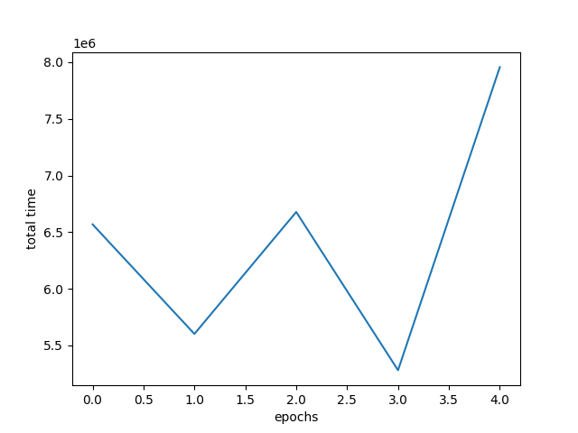

\# Dynamic Traffic Light Control with RL + SUMO

Train a reinforcement-learning agent to control traffic lights in a SUMO simulation using TraCI. The goal is to **reduce total waiting time** by dynamically choosing signal phases.

| Example maps | Training curves |
|---|---|
|  |  |

---

## What this project does

At each simulation step, the agent observes traffic around each junction and selects one of several predefined signal plans. It learns from the reward signal (negative waiting time) to reduce congestion.

### How training works (high level)


flowchart LR
	A[SUMO simulation] <--> B[TraCI control loop]
	B --> C[State: vehicles per lane]
	C --> D[PyTorch MLP (Q-network)]
	D --> E[Action: pick phase 0..3]
	E --> F[Apply traffic light state + durations]
	B --> G[Reward: - waiting_time]
	G --> D

---

## Tech stack (from `train.py`)

- **SUMO** + **TraCI** (`traci`, `sumolib.checkBinary`) for simulation + control
- **PyTorch** for the Q-network (MLP) and optimization
- **NumPy** for experience buffers
- **Matplotlib** for training curves
- **pySerial** (optional) for Arduino integration

---

## RL details (as implemented)

These are the concrete choices used in `train.py`:

- **State**: 4 numbers per junction = vehicle counts on controlled lanes (vehicles beyond 10m in-lane)
- **Actions**: 4 discrete phase options (`0..3`) mapped to predefined red/yellow/green strings
- **Reward**: $r = -\text{waiting\_time}$ (sum of waiting time on controlled lanes)
- **Model**: MLP $4 \rightarrow 256 \rightarrow 256 \rightarrow 4$ with ReLU
- **Loss / optimizer**: MSE + Adam
- **Device**: uses CUDA if available (`cuda` else `cpu`)
- **Artifacts**:
	- model weights: `models/<model_name>.bin`
	- plot: `plots/time_vs_epoch_<model_name>.png`
	- trip info: `tripinfo.xml` (and/or `maps/tripinfo.xml` depending on the run path)

---

## Prerequisites

1. **Install SUMO** (GUI + tools)
2. Set `SUMO_HOME` so Python can import TraCI tools:

**Windows (PowerShell):**
```powershell
$env:SUMO_HOME = "C:\Program Files (x86)\Eclipse\Sumo"
$env:PATH = "$env:SUMO_HOME\bin;$env:PATH"
```

If `SUMO_HOME` is not set, `train.py` exits with:
> please declare environment variable 'SUMO_HOME'

---

## Installation

```bash
pip install -r requirements.txt
```

Notes:
- SUMO itself is typically installed via the official installer/package manager; the Python `traci` module comes from SUMO’s `tools` directory.

---

## Quick start

### 1) Choose a network + route file

The SUMO configuration is controlled by `configuration.sumocfg`. By default it points to:

```xml
<net-file value='maps/city3.net.xml'/>
<route-files value='maps/city3.rou.xml'/>
```

If you generate a new route file (example: `maps/shuvo_city.rou.xml`), update the `<net-file>` and `<route-files>` accordingly.

Important: make sure `configuration.sumocfg` has `<end>` large enough for your run steps.

### 2) (Optional) Generate routes with `randomTrips.py`

The helper script is located under `maps/`.

**From the repo root (Windows):**
```powershell
python .\maps\randomTrips.py -n .\maps\shuvo_city.net.xml -r .\maps\shuvo_city.rou.xml -e 300
```

This writes a route file you can reference from `configuration.sumocfg`.

### 3) Train

```bash
python train.py --train -e 50 -m model_1 -s 500
```

Outputs:
- `models/model_1.bin`
- `plots/time_vs_epoch_model_1.png`

### 4) Run (visualize in SUMO-GUI)

```bash
python train.py -m model_1 -s 500
```

When `--train` is not provided, the script launches `sumo-gui`.

---

## Project structure

```text
.
├─ train.py                # RL agent + TraCI loop (main)
├─ configuration.sumocfg   # SUMO scenario: network + routes
├─ maps/                   # .net.xml, .rou.xml, randomTrips.py, tripinfo
├─ models/                 # saved PyTorch weights (*.bin)
├─ plots/                  # training curves
└─ maps_images/            # screenshots of networks
```

---


## Troubleshooting

- **`can't open file randomTrips.py`**
	- The script lives in `maps/randomTrips.py`. Run `python .\maps\randomTrips.py ...`.

- **`please declare environment variable 'SUMO_HOME'`**
	- Install SUMO and set `SUMO_HOME` to the SUMO install folder.

- **SUMO ends early / fewer steps than expected**
	- Increase `<end value='...'>` inside `configuration.sumocfg` so it covers your `-s` steps.

---

## Example outputs

More plots are available under `plots/` and example models under `models/`.


